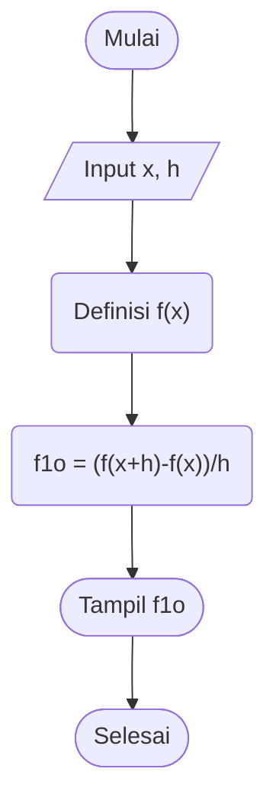
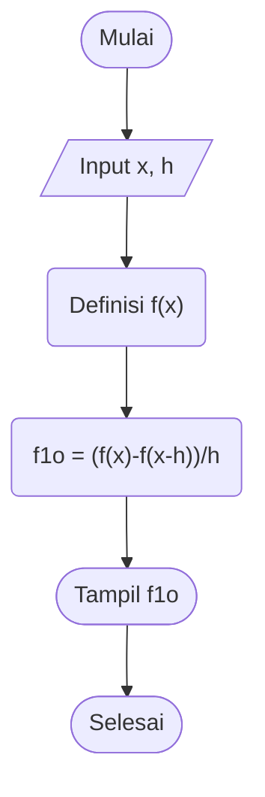
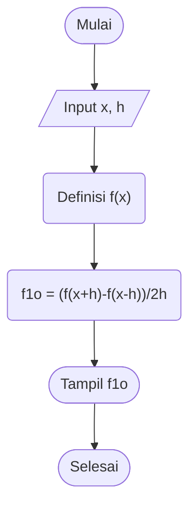

# KN-M8

## Metode Selisih Maju

```mermaid
graph TD;
    A([Mulai])-->B[/Input x, h/];
    B-->C("Definisi f(x)");
    C-->D("f1o = (f(x+h)-f(x))/h");
    D-->E([Tampil f1o]);
    E-->F([Selesai]);
```  

## Metode Selisih Mundur

```mermaid
graph TD;
    A([Mulai])-->B[/Input x, h/];
    B-->C("Definisi f(x)");
    C-->D("f1o = (f(x)-f(x-h))/h");
    D-->E([Tampil f1o]);
    E-->F([Selesai]);
```

## Metode Selisih Pusat

```mermaid
graph TD;
    A([Mulai])-->B[/Input x, h/];
    B-->C("Definisi f(x)");
    C-->D("f1o = (f(x+h)-f(x-h))/2h");
    D-->E([Tampil f1o]);
    E-->F([Selesai]);
```
